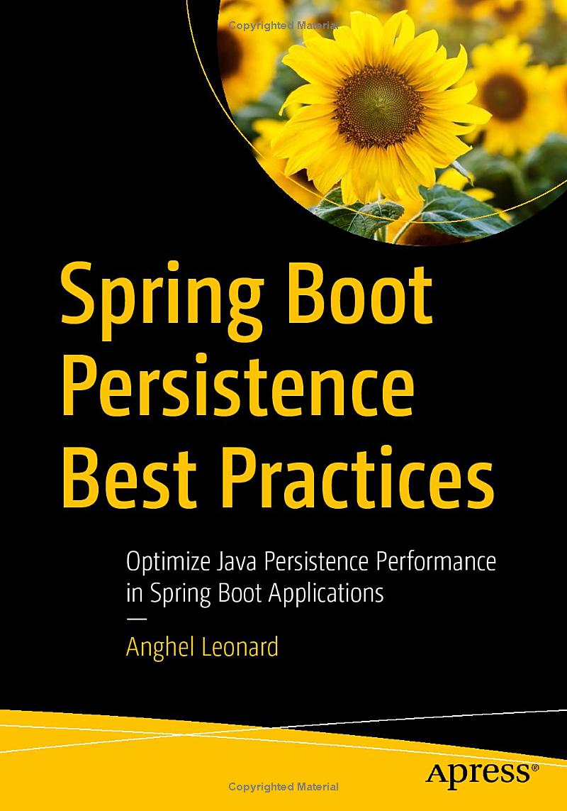

# <스프링 부트 JPA 모범 사례> 예제 코드
> 스프링 부트 기반 애플리케이션에서의 JPA 성능 최적화


---------------------------------------

## Spring Boot Persistence Best Practices
> Optimize Java Persistence Performance in Spring Boot Applications



## 소개
본 리포지토리는 안겔 레오나르드(Anghel Leonard)의 [스프링 부트 JPA 모범사례 (에이콘출판사, 2024)](http://www.acornpub.co.kr/book/spring-boot-jpa)에 대한 예제 코드를 정리해 제공합니다.


> 원서 : [Spring Boot Persistence Best Practices: Optimize Java Persistence Performance in Spring Boot (Apress, 2020)](https://www.amazon.com/Spring-Boot-Persistence-Best-Practices/dp/1484256255)

원서에서 제시되는 리포지토리를 챕터(chapter)별로 구분하고, Java 버전, 관련 프레임워크(Spring, Spring Boot, Hibernate, etc) 등을 일관성 있게 최근(최신 버전이 아닌)으로 변경하는 등의 정리를 제공합니다.


## 예제 구성
저자가 제공하는 예제 리포지토리 대비, 다음과 같은 차이점이 있습니다.
- 예제를 챕터별 하위 디렉토리로 구성함으로써 손쉽게 예제를 찾을 수 있습니다.
- Java 1.8, 12 등 여러 버전을 Java 11(LTS) 버전으로 통일했습니다. 
    - 참고로, 최신 LTS 17 버전은 제시된 Spring v5/Spring Boot v2에서 지원되지만, 일부 다른 관련 library 미지원 문제, Java EE 버전 일치(JDK 17은 Java EE에서 Jakarta EE로 변경) 등의 이유로 적용하지 않았습니다.
- Spring Boot 버전을 v2.2.x에서 v2.7.x로 업그레이드했으며, 이에 따라 일부 설정 등도 맞춰 변경되었습니다.
- 데이터베이스 연결 계정을 전체 관리자 권한인 `root`에서 개별 계정(`bookstore` 등)으로 변경했습니다.
    - 참고로, 원서 예제의 경우 `createDatabaseIfNotExist` 속성(MySQL)을 `true`로 지정해 schema 자체를 새롭게 생성할 수 있도록 관리자 권한을 부여한 것입니다.
- Hibernate `ddl-auto` 속성을 `create`에서 대부분 `validate`로 변경(필요한 경우 `create`를 유지)했습니다.
    - 예제 실행에 필요한 테이블 등의 생성(DDL; Data Definition Language)은 `schema-*.sql` 파일을 통해 처리되며, 다른 예제에서 생성된 관련된 테이블을 모두 삭제하도록 구성되었습니다. (동일한 이름의 테이블이 다른 속성 및 관계를 갖을 수 있으며, 이에 따라 관계가 있는 테이블에 의해 삭제가 되지 않는 경우를 방지) 
- 원서의 내용을 크게 해치지 않는 수준에서 코드 컨벤션(convention) 변경, 코드 수정(warning 제거 등) 및 설정 변경을 했습니다.
- 예제 디렉토리 구성 시, `HibernateSpringBoot*` prefix 부분을 제외하였습니다.
    - 예시 : `HibernateSpringBootOneToManyBidirectional` -> `OneToManyBidirectional`


## 예제 실행을 위한 사전 준비 사항
### 데이터베이스 구성
예제들은 총 3개의 데이터베이스를 사용합니다.
- MySQL
- PostgreSQL
- Microsoft SQL Server (1개 예제)

예제들은 대부분 MySQL를 사용하고, 필요한 경우 PostgreSQL를 사용합니다. 14장의 `INListPadding` 예제만 SQL Server를 활용합니다.

### MySQL 구성
MySQL 사용 예제는 다음과 같은 6개의 database를 사용합니다.
- `bookstoredb`, `citylotsdb`, `numberdb`, `authorsdb`, `booksdb`, `screenshotdb`

예제 실행에 필요한 각 database 및 계정은 다음과 같이 생성합니다.
```sql
create database bookstoredb character set utf8mb4 collate utf8mb4_general_ci;

create user 'bookstore'@'%' identified by 'bookstore';

grant all privileges on bookstoredb.* to 'bookstore'@'%';

flush privileges;
```
※ 실제 DDL 및 DCL(Data Control Language)문은 사용 MySQL 버전에 따라 차이가 있을 수 있으며, 사용 계정 정보 등은 각 예제의 `application.properties` 파일을 참조하세요.

#### 참고사항
일부 예제에서 Trigger 생성이 필요하며, 이를 위해 다음과 같은 명령 실행이 필요합니다. (root 권한으로 실행)

```sql
SET GLOBAL log_bin_trust_function_creators=ON;
```

### PostgreSQL 구성
PostreSQL 사용 예제는 `bookstoredb` 하나를 사용하며, 다음과 같이 database 및 계정을 생성합니다.

```sql
create database bookstoredb;

create user bookstore with encrypted password 'bookstore';

grant all privileges on database bookstoredb to bookstore;
```
※ 실제 DDL 및 DCL(Data Control Language)문은 사용 PostgreSQL 버전에 따라 차이가 있을 수 있으며, 사용 계정 정보 등은 각 예제의 `application.properties` 파일을 참조하세요.

### Microsoft SQL Server 구성
SQL Server 사용 예제는 `bookstoredb` 하나를 사용하며, 다음과 같이 database 및 계정을 생성합니다.
```sql
create database bookstoredb;

create login bookstore
with password = 'bookstore', check_policy = off;

use bookstoredb;

create user bookstore for login bookstore;

EXEC sp_addrolemember 'db_owner', bookstore;
```
※ 실제 DDL 및 DCL(Data Control Language)문은 사용 SQL Serve 종류 및 버전에 따라 차이가 있을 수 있으며, 사용 계정 정보 등은 각 예제의 `application.properties` 파일을 참조하세요.

#### [참고] Docker 기반 MS SQL 실행
Microsoft에서 Docker image를 통해 MS SQL Server와 호환 가능한 Azure SQL Edge를 제공하고 있으며, 이를 통해 예제는 실행 가능합니다.  
> 참조 : https://hub.docker.com/_/microsoft-azure-sql-edge  

Docker 실행 예시는 다음과 같습니다.
```shell
sudo docker run --cap-add SYS_PTRACE -e "ACCEPT_EULA=1" -e "MSSQL_SA_PASSWORD=password" -p 1433:1433 --name sqlserver -d mcr.microsoft.com/azure-sql-edge
```

참고로, SQL Server Linux 컨테이너 이미지도 제공되나 Linux(amd64) 호스트만 지원합니다. (Windows 또는 Mac에서는 사용 불가)
> 참조 : https://learn.microsoft.com/ko-kr/sql/linux/quickstart-install-connect-docker?view=sql-server-ver16&pivots=cs1-bash

## Chapter별 예제
> **Note**  
> 일부 예제 실행 시, 추가 설정 또는 참고가 필요한 사항은 아래 각 챕터별 페이지 기술함 

- [Chapter 1 : Associations](chapter1/README.md)
- [Chapter 2 : Entities](chapter2/README.md)
- [Chapter 3 : Fetching](chapter3/README.md)
- [Chapter 4 : Batching](chapter4/README.md)
- [Chapter 5 : Collections](chapter5/README.md)
- [Chapter 6 : Connections and Transactions](chapter6/README.md)
- [Chapter 7 : Identifiers](chapter7/README.md)
- [Chapter 8 : Calculating Properties](chapter8/README.md)
- [Chapter 9 : Monitoring](chapter9/README.md)
- [Chapter 10 : Configuring DataSource and Connection Pool](chapter10/README.md)
- [Chapter 11 : Audit](chapter11/README.md)
- [Chapter 12 : Schemas](chapter12/README.md)
- [Chapter 13 : Pagination](chapter13/README.md)
- [Chapter 14 : Queries](chapter14/README.md)
- [Chapter 15 : Inheritance](chapter15/README.md)
- [Chapter 16 : Types and Hibernate Types](chapter16/README.md)
- Appendix
    - [Appendix G : Spring Transaction Propagation](appendix/TransactionPropagation/README.md)
    - [Appendix I : Second Level Cache](appendix/SecondLevelCache/README.md)

## 참조
- 번역서 정보 : http://www.acornpub.co.kr/book/spring-boot-jpa
- 원서 정보 : https://link.springer.com/book/10.1007/978-1-4842-5626-8
- 원저자 예제 코드 : https://github.com/AnghelLeonard/Hibernate-SpringBoot (라이선스: Apache license v2.0)

## 라이선스
Apache license, version 2.0
